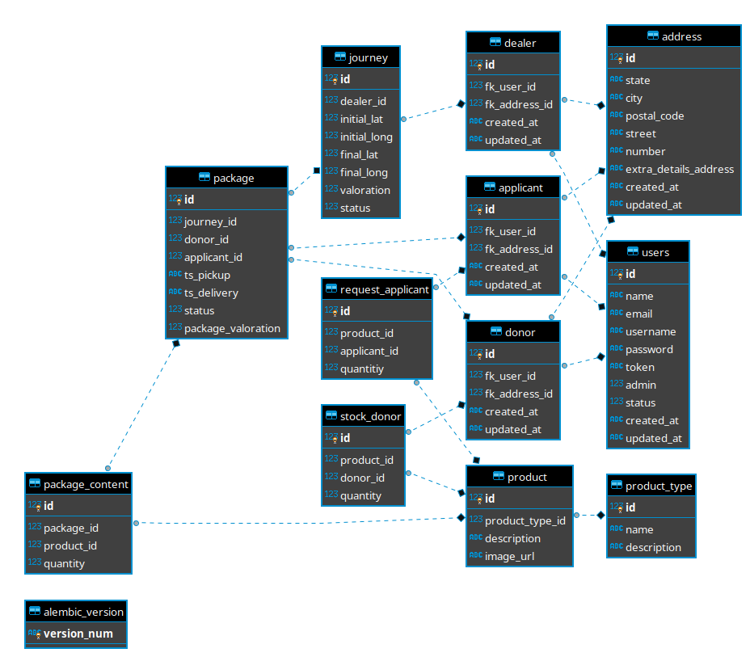

# Hackathon Optimization Material Delivery

## Getting Started

### Prerequisites

### Installing

This steps will be on Windows

```
  git clone https://github.com/daniel8rc/hackathon_optimizacion_entregas_material.git
  py -3 -m venv venv
  venv\Scripts\activate
  pip install -r requirements.txt
  pipenv install
  npm install
  npm run development
  python main.py
```

### Installing Linux

This steps will be on Linux

```
  python3 -m venv venv

  source venv/bin/activate

  pip3 install -r requirements.txt

  pipenv install

  npm install

  npm run development or npm run watch

  python3 main.py
```

### BBDD



## Running the tests

### Break down into end to end tests

### And coding style tests

## Deployment

## Built With

## Contributing

## Versioning

## Authors

## License

## Acknowledgments
